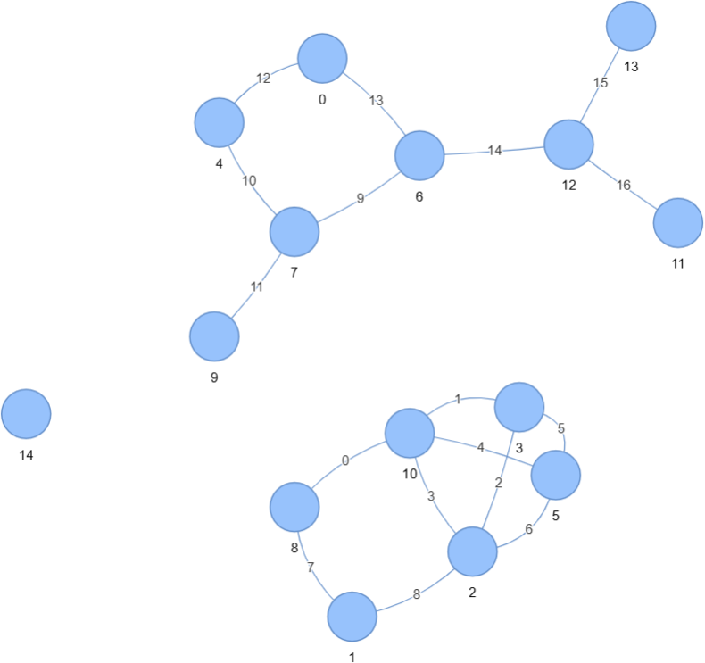

Grafy -- souvislost
===================

3 komponenty, 1 izolovaný vrchol
--------------------------------

.. list-table::
   :widths: 1 1
   :header-rows: 0

   * - `name`
     - 3 components, 1 isolated vertex
   * - `number`
     - 2.0

